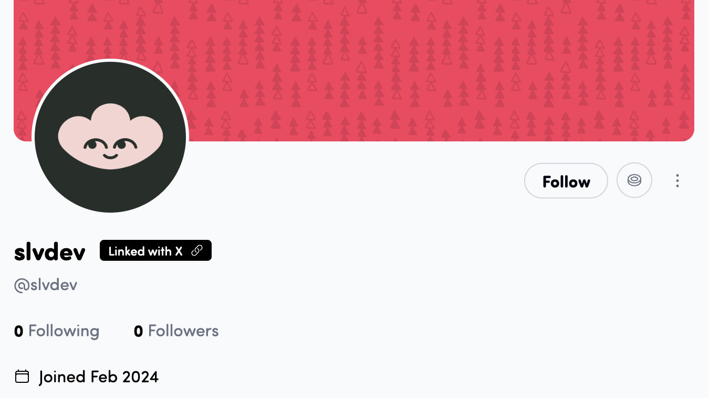

<div align="center">

# ✨ LenX ✨

**Sync Your X. Supercharge Your Lens.**

[](https://nextjs.org/)
[](https://tailwindcss.com/)
[](https://lens.xyz/)
<br />
[](https://x.com/slvdev)
[](https://hey.xyz/u/slvdev)
<br />
[](https://opensource.org/licenses/MIT)

</div>

---

<p align="center">
  <em>Link your X (Twitter) identity with your Lens Protocol Account - mint your X handle in a dedicated LenX namespace.</em>
</p>

<div align="center">
  
</div>

---

## 🚀 What is LenX?

LenX is a trusted service that verifies X identity and mints LenX Handles to be 1<>1 linked with Lens Accounts. It allows to:

1.  **Simplify Onboarding:** Bring X users into Lens seamlessly, keeping their existing X handle.
2.  **Prevent Fakes:** Validate that a given Lens Account is actually controlled by the same person who has the same X handle.
3.  **Social Discovery:** Discover who of your X friends is already on Lens.

LenX aims to bridge the gap between the Web2 social experience you know and the exciting possibilities of Web3 social.

---

## 🌌 How It Flows: The LenX Experience

1.  **Step 1: Log in with your X account**

2.  **Step 2: Log in with your Lens account**

    - Connect your favorite cryptocurrency wallet (MetaMask, Coinbase Wallet, etc.) via ConnectKit.
    - This wallet should be the **Owner EOA** of your Lens Account.
    - Choose which Lens Account to use if wallet controls many

3.  **Step 3: Link your X Handle to Lens Account**

---

## 🎨 The Vibe: Tech & Aesthetics

LenX is built with a modern tech stack and a focus on a visually engaging experience:

- **Frontend:** Next.js, React, TypeScript
- **Styling & Animation:** Tailwind CSS, Framer Motion
- **Background Magic:** `ogl` for the captivating background threads.
- **Web3 Power:**
  - `ConnectKit` for a seamless wallet connection experience.
  - `wagmi` & `viem` for robust blockchain interactions.
  - `@lens-protocol/client` for all things Lens.
- **X Integration:** Secure X OAuth 2.0 with PKCE for handle fetching.
- **Blockchain:**
  - **Lens Chain (ID 232):** For Lens Protocol smart account operations.
- **Package Manager:** PNPM

---

## 🛣️ Roadmap: The Journey Ahead

LenX is currently an MVP, focused on the core X-to-Lens linking. Here's what's on the horizon:

- ✅ **X Login & Handle Fetching**
- ✅ **Wallet Connection & Lens Account Log In**
- ✅ **Link X Handle in LenX Namespace on Lens**
- ⏳ **Lens Account creation:** Create a Lens Account if user doesn't have one.
- ⏳ **Discover X Friends on Lens:** Find all your bros.
- ⏳ **Sync User's X Posts to Lens Feed:** Bring your content over to Lens (and back to X).
- ⏳ **Even easier on-boarding:** Initial user on-boarding without crypto wallets.

---

## 🛠️ Getting Started (Development)

1.  **Clone the repository:**
    ```bash
    git clone <repository-url>
    ```
2.  **Install dependencies:**
    ```bash
    pnpm install
    ```
3.  **Set up environment variables:**
    Create a `.env.local` file in the root and add your API keys and configurations:

    ```env
    NEXT_PUBLIC_APP_URL=
    NEXT_PUBLIC_WALLETCONNECT_PROJECT_ID=
    NEXT_PUBLIC_X_CLIENT_ID=
    X_CLIENT_SECRET=
    ```

    - Ensure your X App has the correct callback URI configured: `http://localhost:3000/api/auth/x/callback` (for local dev).

4.  **Run the development server:**
    ```bash
    pnpm dev
    ```
5.  Open [http://localhost:3000](http://localhost:3000) in your browser.

---

## 🙌 Contributing

Contributions are welcome! Whether it's bug fixes, feature suggestions, or improvements, please feel free to open an issue or submit a pull request.

---

## 📜 License

This project is licensed under the MIT License - see the [LICENSE](/LICENSE) file for details.

---

<div align="center">
  <em>Let's build the future of social, together.</em>
  <br/>
  <strong>LenX</strong>
</div>
